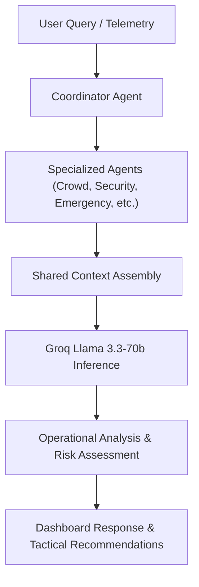

# 🏟️ FIFA World Cup 2026 – Smart Stadium Operations AI

> **An AI-powered Multi-Agent Command Center for intelligent stadium operations, real-time monitoring, incident response, and decision support during large-scale sporting events.**


---

# 📖 Overview

Managing a modern sports stadium during a tournament like the **FIFA World Cup 2026** requires continuous monitoring of thousands of events occurring simultaneously—from crowd movement and security incidents to weather changes, transportation, and emergency response.

Traditional monitoring dashboards display information but still require operators to manually analyze situations and decide what to do next.

**Smart Stadium Operations AI** combines a real-time simulation engine with a collaborative Multi-Agent AI architecture to assist operators by transforming live telemetry into structured operational insights and recommendations.

---

# 🌍 Live Demo

Experience the live, production-ready environment of the Smart Stadium Operations AI:

🔗 **[Live Command Center Deployment](https://smart-stadium-operations-ai-1.onrender.com)**

### What Reviewers Can Explore:
*   **Live Telemetry**: Real-time stadium metrics, attendance counters, gate occupancy, queue wait times, and system logs.
*   **AI Operations Assistant**: Interact with the stateless AI assistant to query stadium status, analyze logs, and run commands.
*   **Simulation Engine**: Trigger various operational scenarios (Normal Match, High Crowd, Medical Emergency, Security Threat, Severe Weather, Full Evacuation) and watch the dashboard adapt dynamically.
*   **Analytics Dashboard**: Interactive charts visualizing attendance trends, queue times, and parking lot occupancy.
*   **Multi-Agent System**: Watch the Coordinator and specialized agents collaborate to analyze situations and issue recommendations.

---

# 🚀 Repository Highlights

*   **Production-Ready FastAPI Backend**: Asynchronous endpoints optimized for low latency and high concurrency.
*   **Multi-Agent AI Architecture**: Collaborative network of specialized agents coordinated by a central orchestrator.
*   **Groq-Powered Inference**: Lightning-fast response times driven by Groq's high-speed inference engine.
*   **Real-Time Telemetry**: Seamlessly simulated stadium operational metrics updating at second-level intervals.
*   **Interactive Command Dashboard**: A modern, dark-mode dashboard tailored for stadium incident commanders.
*   **Stateless AI Assistant**: Conversation sessions that reset between loads to eliminate context drift and hallucination.
*   **Live Analytics**: Dynamic Chart.js visualizations tracking attendance, queues, and resource utilization.
*   **Automatic Render Deployment**: CI/CD pipeline integrated directly for GitHub to Render automatic builds.
*   **Modular ES6 Frontend**: Clean, decoupled JavaScript modules managing specific dashboard logic.
*   **Clean Project Architecture**: Strictly structured directories separating backend APIs, frontend, models, and agents.

---

# 🎯 Problem Statement

Large sporting events involve managing:

- Crowd density
- Security threats
- Medical emergencies
- Weather disruptions
- Transportation flow
- Infrastructure maintenance
- Visitor assistance

Operators often receive large amounts of fragmented information from multiple systems, making rapid decision-making difficult.

This project demonstrates how AI agents can coordinate, analyze operational telemetry, and assist human operators with actionable recommendations.

---

# 💡 Solution

The platform combines:

- Real-time Stadium Simulation
- AI Multi-Agent Coordination
- Interactive Operations Dashboard
- Live Analytics
- Incident Management
- AI Decision Support

Each specialized AI agent focuses on a specific operational domain while a central **Coordinator Agent** synthesizes their outputs into a unified response.

### 👥 Human-in-the-Loop Operations
The system is built on a Human-in-the-Loop (HITL) model. The AI agents are designed strictly to assist, not replace, human decision makers. Human operators retain final authority and command responsibility over all stadium directives. The platform provides structured operational intelligence, prioritizes risks based on safety parameters, and recommends specific, actionable steps so commanders can make informed decisions rapidly.

---

# ✨ Key Features

## 🤖 Multi-Agent AI Architecture

Specialized agents collaborate together:

- Crowd Management Agent
- Security Agent
- Emergency Response Agent
- Transportation Agent
- Maintenance Agent
- Visitor Support Agent
- Weather Intelligence Agent

All communication is orchestrated through a **Coordinator Agent** powered by Groq inference.

---

## 🏟️ Real-Time Stadium Simulation

Supports multiple operational scenarios:

- ✅ Normal Match
- ✅ High Crowd Match
- ✅ Medical Emergency
- ✅ Security Threat
- ✅ Severe Weather
- ✅ Full Stadium Evacuation

Every scenario dynamically updates:

- Attendance
- Gate status
- Parking occupancy
- Queue times
- Weather
- Alerts
- AI recommendations

---

## 📊 Interactive Operations Dashboard

Features include:

- Live telemetry
- Animated attendance counter
- Dynamic gate visualization
- Incident feed
- KPI monitoring
- Analytics charts
- AI confidence score
- Operations log
- Real-time clock
- AI chat interface

---

## 📈 Analytics

Interactive charts display:

- Attendance trend
- Queue time trend
- Parking utilization
- Alert history

---

## ⚙️ Modular Frontend

The dashboard is organized into independent ES6 modules:

```
DashboardController
DashboardAPI
AttendanceAnimator
GateManager
IncidentFeed
SimulationController
ChatController
SidebarController
ClockManager
ToastManager
LoadingManager
Utils
```

This improves maintainability, scalability, and separation of concerns.

---

# 🤖 AI Decision Workflow

Below is the workflow showing how operational queries and telemetry are processed through the multi-agent system:



---

# 🏗️ System Architecture

```
                     Stadium Telemetry
                            │
                            ▼
                  Simulation Engine
                            │
                            ▼
                  Coordinator Agent (Groq / Llama 3.3 70B)
                            │
      ┌────────────┬────────────┬────────────┐
      ▼            ▼            ▼
 Crowd Agent   Security     Emergency
                  Agent        Agent

      ▼            ▼            ▼
Transport     Maintenance    Weather

              ▼
       Visitor Support

              ▼
        FastAPI Backend

              ▼
 Interactive Command Center
```

---

# 💬 Chat Architecture

The AI Operator Chat features a stateless, high-reliability design:
- **Stateless AI Assistant**: The chat assistant does not retain session state, ensuring each request is evaluated purely on current, verified telemetry.
- **Session-Bound UI**: Every browser refresh starts a fresh operational session.
- **No Persistence**: Conversation history is intentionally NOT persisted to prevent the carryover of stale metrics or resolved alerts.
- **Intentional Clear**: Chat history is cleared between sessions to eliminate LLM hallucinations and maintain a clean operational context.

---

# 📊 Performance Highlights

*   **Reduced Token Usage**: Telemetry and context payloads are strictly pruned to prevent token bloat.
*   **Optimized Prompts**: Prompt templates are carefully engineered to produce dense, structured operational directives with minimal token overhead.
*   **Lower Inference Latency**: The application leverages Groq's specialized hardware platform for extremely low latency.
*   **Groq High-Speed Inference**: Sub-second token generation times for immediate tactical assistance.
*   **Stateless Chat Architecture**: Bypassing server-side history checks cuts database lookup times to zero.
*   **Faster Response Generation**: Highly concurrent asynchronous agent orchestration reduces total wait times.
*   **Reduced API Costs**: Optimal token density and minimal model invocations ensure high cost-efficiency.
*   **Modular Architecture**: Parallelized task execution avoids execution blocking.
*   **Lightweight Frontend**: Vanilla ES6 components run entirely client-side without bloated framework initialization steps.

---

# ⚡ Why Groq?

Groq has been integrated as the primary AI inference provider for its unique capabilities in real-time environments:
*   **Extremely Low Latency**: In stadium command centers, response speed is measured in seconds. Groq's high-speed inference ensures answers are returned instantly.
*   **Production Scalability**: Highly predictable response times under load, making it suitable for multi-agent workloads.
*   **Cost Efficiency**: Highly optimized token processing enables sustainable long-term hosting.
*   **Better User Experience**: Seamless chat rendering and fast recommendations keep operators focused.
*   **Reliable Structured Outputs**: Consistent execution of system instructions and complex operational schemas.
*   **Real-Time Suitability**: Meets the immediate situational awareness needs of live incident commanders.

---

# 📈 Project Status

- **Production Ready**: Fully polished, tested, and ready for deployment.
- **Live Deployment Available**: Live application instances can be hosted for instant access.
- **Automatic GitHub → Render Deployment**: Configured with CI/CD triggers to automatically redeploy from the GitHub repository directly to Render.
- **Optimized for Hackathon Evaluation**: Pre-configured scenarios and optimized inference speeds ensure a seamless reviewer experience.

---

# 🛠 Technology Stack

## Backend

- Python 3.12
- FastAPI
- Pydantic
- AsyncIO

## AI

- Groq API (Groq Python SDK)
- Llama 3.3 70B Versatile model (`llama-3.3-70b-versatile`)
- Groq high-speed inference
- Multi-Agent Architecture

## Frontend

- HTML5
- CSS3
- Vanilla JavaScript (ES6 Modules)
- Chart.js

---

# 📂 Project Structure

```
smart-stadium-operations-ai/
│
├── .github/
│   └── workflows/
│       └── keep-render-awake.yml     # GitHub Actions workflow to keep Render active
│
├── agents/                           # Multi-Agent systems layer
│   ├── base_agent.py                 # Common agent interface and prompt execution
│   ├── coordinator.py                # Coordinating orchestrator agent
│   ├── crowd_management_agent.py     # Specialised agent for crowd egress and logistics
│   ├── emergency_response_agent.py   # Specialised agent for medical/evacuation dispatch
│   ├── maintenance_agent.py          # Specialised agent for facility checkups
│   ├── security_agent.py             # Specialised agent for security dispatch and risk mitigation
│   ├── transportation_agent.py       # Specialised agent for transit lines and parking lot flow
│   ├── visitor_support_agent.py      # Specialised agent for info requests and public alerts
│   └── weather_intelligence_agent.py # Specialised agent for storm/wind scenario monitoring
│
├── assets/                           # Image assets and screenshots gallery
│   ├── crowd_operations.png
│   ├── dashboard_normal.png
│   ├── emergency_response.png
│   ├── security_operations.png
│   └── transportation_logistics.png
│
├── backend/                          # FastAPI Backend Layer
│   ├── routes/                       # FastAPI router endpoints
│   │   ├── agents.py                 # Sub-agent analysis results route
│   │   ├── chat.py                   # Chat Operations Route (Groq Llama 3.3 endpoint)
│   │   ├── health.py                 # Health and status checking route
│   │   └── simulation.py             # Simulation controls and telemetry state route
│   ├── config.py                     # Config settings parsing environment variables
│   ├── dependencies.py               # Dependency injection providers for services/agents
│   ├── exceptions.py                 # App-wide exception handlers
│   ├── logger.py                     # Custom logger configuring formatting
│   └── main.py                       # Main FastAPI app server setup
│
├── frontend/                         # Vanilla CSS/JS client app
│   ├── js/                           # Decoupled ES6 scripts
│   │   ├── AttendanceAnimator.js     # Live attendance counter animator
│   │   ├── ChatController.js         # Chat UI interactive client
│   │   ├── ClockManager.js           # Header local date time display
│   │   ├── DashboardAPI.js           # AJAX fetch client wrappers
│   │   ├── DashboardController.js    # Master page state orchestrator
│   │   ├── GateManager.js            # Gate status grids manager
│   │   ├── IncidentFeed.js           # Dynamic alerts updates drawer
│   │   ├── LoadingManager.js         # Loader overlays manager
│   │   ├── SidebarController.js      # Sidebar items navigator
│   │   ├── SimulationController.js   # Simulation scenarios control bar
│   │   ├── ToastManager.js           # Status toast messaging notifications
│   │   └── Utils.js                  # Shared styling utility helpers
│   ├── index.html                    # Single Page Application HTML frame
│   ├── script.js                     # ES6 entry point script
│   └── style.css                     # Command center CSS design stylesheet
│
├── models/                           # Common models
│   └── schemas.py                    # Pydantic schemas for data validation
│
├── services/                         # Internal core services
│   ├── context_manager.py            # Local cache of incident scenarios context
│   ├── gemini_service.py             # Groq service layer (wrapper class)
│   ├── prompt_manager.py             # Prompt builder with templated guidelines
│   ├── response_parser.py            # Helper utility parsing structured JSON blocks
│   └── simulation_engine.py          # State engine generating telemetry values
│
├── tests/                            # PyTest suites
│   ├── test_agents.py                # Sub-agents logic flow tests
│   └── test_main.py                  # API routes integration tests
│
├── utils/                            # Shared general helpers
├── .env.example                      # Reference environment configuration
├── requirements.txt                  # Python dependencies
├── MULTI_AGENT_ARCHITECTURE.md       # Multi-agent design detail documentation
├── PROJECT_BLUEPRINT.md              # Application design blueprint document
└── README.md                         # Main repository documentation
```

---

# 🚀 Installation

## Clone Repository

```bash
git clone https://github.com/rroshan-cell/smart-stadium-operations-ai.git

cd smart-stadium-operations-ai
```

---

## Install Dependencies

```bash
pip install -r requirements.txt
```

---

## Configure Environment

Create a `.env` file:

```env
GROQ_API_KEY=YOUR_GROQ_API_KEY
AI_MODEL=llama-3.3-70b-versatile
LOG_LEVEL=INFO
```

---

## Run Application

```bash
python -m uvicorn backend.main:app --reload
```

Open:

```
http://127.0.0.1:8000
```

---

# 🌐 API Endpoints

| Method | Endpoint | Description |
|----------|----------------------------|----------------------------------|
| GET | `/api/v1/simulation/state` | Get live telemetry |
| POST | `/api/v1/simulation/start` | Start simulation |
| POST | `/api/v1/chat` | AI operator chat (Groq-powered) |
| GET | `/api/v1/agents/status` | Agent status |
| GET | `/api/v1/agents/alerts` | Active alerts |
| GET | `/health` | Health check |

---

# 🧪 Testing

Run:

```bash
python -m pytest
```

Latest verified result:

```
==========================
3 passed
==========================
```

---

# 🔒 Security

*   **Environment-Based Secret Management**: All credentials (e.g., `GROQ_API_KEY`) are managed strictly via system environment variables.
*   **No Secrets Committed to Git**: Essential configuration credentials and keys are excluded from code versioning.
*   **Request Validation**: Strict request parameters and datatypes are validated at the API boundary using Pydantic schemas.
*   **Defensive API Design**: Strong error bounds and custom fallbacks ensure that backend exceptions never leak raw stack traces or internal infrastructure details.
*   **Stateless AI Conversations**: The AI assistant handles user prompts and telemetry queries statelessly to prevent context drift, data leakage, and session cross-contamination.
*   **No Persistent Chat Storage**: Chat histories are intentionally kept in volatile memory or discarded immediately after response synthesis.
*   **Operational Privacy**: No personal identifier information is processed or stored, keeping telemetry strictly focused on hardware and logistics events.
*   **Secure Deployment Practices**: Continuous delivery configurations on Render deploy through isolated containers and enforce SSL-terminated HTTPS.
*   **Centralized Exception Handling**: All application exceptions are intercepted and mapped to appropriate error responses.
*   **Structured Logging**: Application events and security indicators are stored in structured JSON formats.

---

# ♿ Accessibility

The dashboard includes:

- Semantic HTML
- ARIA-friendly structure
- Responsive layouts
- High-contrast interface
- Keyboard-friendly navigation where applicable

---

# 🚀 Deployment

The application is designed as a **single FastAPI application** serving both backend APIs and frontend static assets. This facilitates instant, hassle-free deployment:

- **Automatic GitHub → Render deployment**: Easily host the app on Render, which automatically builds and runs the containerized or Python-based project.
- Also compatible with:
  - Railway
  - Azure App Service
  - Google Cloud Run

---

# 📸 Screenshots

Below is a visual walkthrough of the Smart Stadium Operations AI dashboard and the specialized operational command views.

### 1. Operations Command Center Dashboard

*The main command center interface displaying live telemetry, dynamic stadium gates, the AI active incident feed, the AI Operations Assistant chat interface, facilities status, and resource counts.*

### 2. Crowd Operations Management

*Real-time crowd analysis showing crowd density index, concourse hotspots, predictive egress times, and specialized AI crowd mitigation recommendations.*

### 3. Security Command Operations

*Security operations view featuring threat assessments, active security patrols, live CCTV camera matrices, and security log dispatch.*

### 4. Emergency Response Directive

*Emergency directive module outlining evacuation readiness, active medical/life-safety units, triage tent statuses, and live safety dispatch queues.*

### 5. Transportation & Infrastructure Logistics

*Logistics dashboard tracking parking lot capacities, regional traffic indices, transit shuttle statuses, and average egress ETA metrics.*

---

# 🔮 Future Improvements

- IoT sensor integration
- Predictive crowd analytics
- CCTV/video intelligence
- Digital twin visualization
- Multi-stadium orchestration
- Support for multiple LLM providers

---

# 🎯 Challenge Alignment

This project addresses the **PromptWars Challenge 4 – Smart Stadiums & Tournament Operations** by demonstrating how AI-assisted operational intelligence can support large-scale sporting events through:

- Multi-Agent Collaboration
- Real-Time Monitoring
- Intelligent Decision Support
- Scenario Simulation
- Human-in-the-Loop Operations

---

# 👨‍💻 Author

**RITIK ROSHAN**

B.Tech Electronics & Communication Engineering

University of Lucknow

GitHub:
https://github.com/rroshan-cell

---

## ⭐ If you found this project interesting, consider giving it a star.