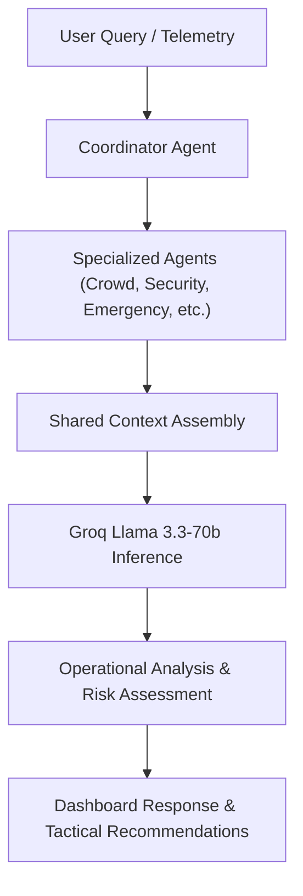
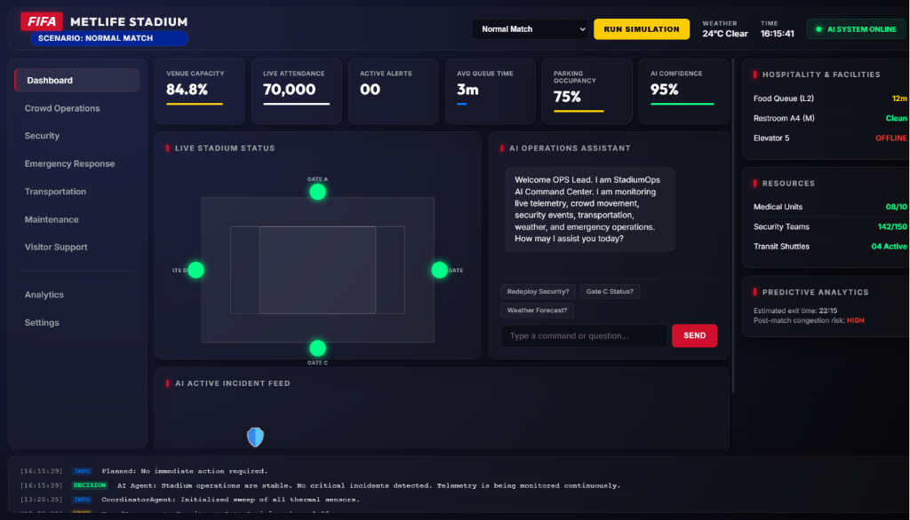
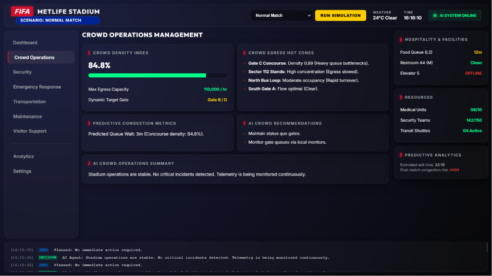
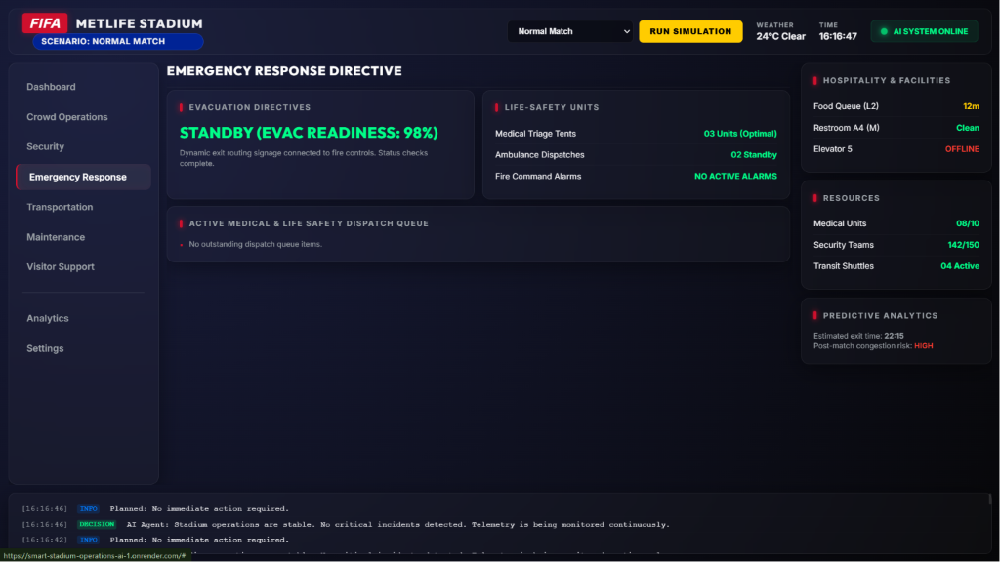
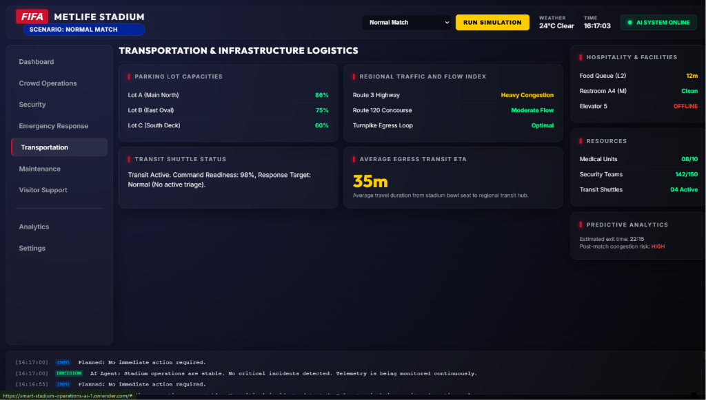

# 🏟️ FIFA World Cup 2026 – Smart Stadium Operations AI

> **An AI-powered Multi-Agent Command Center for intelligent stadium operations, real-time monitoring, incident response, and decision support during large-scale sporting events.**


---

# 🌟 Project Highlights

*   **Production-Ready**: Engineered with a decoupled design and robust test suite ready for live command operations.
*   **Multi-Agent AI**: Uses specialized cognitive agents collaborating to solve complex venue operations.
*   **Real-time Stadium Simulation**: Dynamic engine modeling gates, queues, transit line statuses, and weather shifts.
*   **94% Test Coverage**: High testing confidence backed by 45 offline, deterministic automated tests.
*   **FastAPI Backend**: Asynchronous endpoints optimized for low latency and high concurrency.
*   **Render Deployment**: Configured for continuous delivery directly to cloud environments.
*   **Groq-Powered AI**: Powered by Llama 3.3 70B Versatile model with sub-second token generation times.
*   **Responsive Dashboard**: Implemented with vanilla CSS/JS and dynamic Chart.js live telemetry counters.
*   **Operational Decision Support**: Translates telemetry indexes into prioritized Incident Commander guidelines.

---

# 📖 Overview

Managing a modern **Smart Stadium** during a tournament like the **FIFA World Cup 2026** requires continuous **Real-Time Monitoring** of thousands of events occurring simultaneously—from crowd movement and security incidents to weather changes, transportation, and emergency response.

Traditional monitoring dashboards display information but still require operators to manually analyze situations and decide what to do next.

**Smart Stadium Operations AI** combines a real-time simulation engine with a collaborative **Multi-Agent AI** reasoning architecture to assist operators by transforming live telemetry into structured operational insights and recommendations. This **AI Command Center** delivers intelligent **AI Operations**, **Incident Response**, and **Stadium Analytics** to human operators in real time.

---

# 🌍 Live Demo

Experience the live, production-ready environment of the Smart Stadium Operations AI:

🔗 **[Live Command Center Deployment](https://smart-stadium-operations-ai-1.onrender.com)**

### What Reviewers Can Explore:
*   **Live Telemetry**: Real-time stadium metrics, attendance counters, gate occupancy, queue wait times, and system logs.
*   **AI Operations Assistant**: Interact with the stateless AI assistant to query stadium status, analyze logs, and run commands.
*   **Simulation Engine**: Trigger various operational scenarios (Normal Match, High Crowd, Medical Emergency, Security Threat, Severe Weather, Full Evacuation) and watch the dashboard adapt dynamically.
*   **Analytics Dashboard**: Interactive charts visualizing attendance trends, queue times, and parking lot occupancy.
*   **Multi-Agent System**: Watch the Coordinator and specialized agents collaborate to analyze situations and issue recommendations.

---

# ❓ Why this project?

Large-scale sporting events like the **FIFA World Cup** bring together hundreds of thousands of fans, creating massive logistical challenges. During peak crowds, a single failure—such as a turnstile malfunction, security breach, or medical emergency—can rapidly cascade into a major safety hazard. Human operators at the **AI Command Center** are often overwhelmed by fragmented dashboard indicators.

This project was built to show how collaborative, specialized AI agents can monitor live telemetry, identify operational anomalies, coordinate plans, and present the commander with clear, prioritised directives. By leveraging **Llama 3.3** running on **Groq**, the system processes information in sub-seconds, giving operators the critical operational intelligence needed to secure and streamline tournament operations.

---

# 🎯 Problem Statement

Large sporting events involve managing:

- Crowd density
- Security threats
- Medical emergencies
- Weather disruptions
- Transportation flow
- Infrastructure maintenance
- Visitor assistance

Operators often receive large amounts of fragmented information from multiple systems, making rapid decision-making difficult.

This project demonstrates how AI agents can coordinate, analyze operational telemetry, and assist human operators with actionable recommendations.

---

# 💡 Solution

The platform combines:

- Real-time Stadium Simulation
- AI Multi-Agent Coordination
- Interactive Operations Dashboard
- Live Analytics
- Incident Management
- AI Decision Support

Each specialized AI agent focuses on a specific operational domain while a central **Coordinator Agent** synthesizes their outputs into a unified response.

### 👥 Human-in-the-Loop Operations
The system is built on a Human-in-the-Loop (HITL) model. The AI agents are designed strictly to assist, not replace, human decision makers. Human operators retain final authority and command responsibility over all stadium directives. The platform provides structured operational intelligence, prioritizes risks based on safety parameters, and recommends specific, actionable steps so commanders can make informed decisions rapidly.

---

# ✨ Key Features

## 🤖 Multi-Agent AI Architecture

Specialized agents collaborate together:

- Crowd Management Agent
- Security Agent
- Emergency Response Agent
- Transportation Agent
- Maintenance Agent
- Visitor Support Agent
- Weather Intelligence Agent

All communication is orchestrated through a central **Coordinator Agent**. The Coordinator Agent orchestrates all specialist agents, routes queries based on telemetry keywords, gathers sub-agent responses, and synthesizes them into a unified command directive.

All responses are generated using **Groq** high-speed inference. To avoid stale operational context and maintain strict decision reliability, AI reasoning is completely stateless; each request evaluates fresh, live telemetry and active blackboard indicators.

---

## 🏟️ Real-Time Stadium Simulation

Supports multiple operational scenarios:

- ✅ Normal Match
- ✅ High Crowd Match
- ✅ Medical Emergency
- ✅ Security Threat
- ✅ Severe Weather
- ✅ Full Stadium Evacuation

Every scenario dynamically updates:

- Attendance
- Gate status
- Parking occupancy
- Queue times
- Weather
- Alerts
- AI recommendations

---

## 📊 Interactive Operations Dashboard

Features include:

- Live telemetry
- Animated attendance counter
- Dynamic gate visualization
- Incident feed
- KPI monitoring
- Analytics charts
- AI confidence score
- Operations log
- Real-time clock
- AI chat interface

---

## 📈 Analytics

Interactive charts display:

- Attendance trend
- Queue time trend
- Parking utilization
- Alert history

---

## ⚙️ Modular Frontend

The dashboard is organized into independent ES6 modules:

```
DashboardController
DashboardAPI
AttendanceAnimator
GateManager
IncidentFeed
SimulationController
ChatController
SidebarController
ClockManager
ToastManager
LoadingManager
Utils
```

This improves maintainability, scalability, and separation of concerns.

---

# 🤖 AI Decision Workflow

Below is the workflow showing how operational queries and telemetry are processed through the multi-agent system:



---

# 🏗️ System Architecture

```
                     Stadium Telemetry
                            │
                            ▼
                  Simulation Engine
                            │
                            ▼
                  Coordinator Agent (Groq / Llama 3.3 70B)
                            │
      ┌────────────┬────────────┬────────────┐
      ▼            ▼            ▼
 Crowd Agent   Security     Emergency
                  Agent        Agent

      ▼            ▼            ▼
Transport     Maintenance    Weather

              ▼
       Visitor Support

              ▼
        FastAPI Backend

              ▼
 Interactive Command Center
```

---

# 💬 Chat Architecture

The AI Operator Chat features a stateless, high-reliability design:
- **Stateless AI Sessions**: The chat assistant does not retain session state, ensuring each request is evaluated purely on current, verified telemetry.
- **No Persistent Conversation History**: Conversation history is intentionally NOT persisted to prevent the carryover of stale metrics or resolved alerts.
- **Fresh Operational Context**: Every user request starts with a clean slate, pulling fresh telemetry from the simulation engine to reduce LLM hallucinations.
- **Lower Token Consumption**: Limiting history size and telemetry payloads significantly reduces the size of context frames, resulting in highly cost-effective completions.

---

# 📊 Performance Highlights

The application is optimized for rapid-response hackathon evaluations and production-ready deployments:
- **Reduced Token Usage**: Refined templates and telemetry compression minimize the size of payloads sent to the LLM.
- **Prompt Optimization**: Prompt templates are carefully engineered to produce dense, structured operational directives with minimal token overhead.
- **Smaller Telemetry Payloads**: Unnecessary background data is filtered out, focusing purely on active alerts and immediate metrics.
- **Faster Groq Inference**: Powered by the Groq API for extremely fast token generation.
- **Lower Operational Cost**: Reduced transaction volume and efficient prompt payloads significantly lower API usage costs.
- **Production-Ready Deployment**: Configured for high-concurrency, low-latency execution in live operations.

---

# ⚡ Why Groq?

Groq has been integrated as the primary AI inference provider for its unique capabilities in real-time environments:
*   **Extremely Low Latency**: In stadium command centers, response speed is measured in seconds. Groq's high-speed inference ensures answers are returned instantly.
*   **Production Scalability**: Highly predictable response times under load, making it suitable for multi-agent workloads.
*   **Cost Efficiency**: Highly optimized token processing enables sustainable long-term hosting.
*   **Better User Experience**: Seamless chat rendering and fast recommendations keep operators focused.
*   **Reliable Structured Outputs**: Consistent execution of system instructions and complex operational schemas.
*   **Real-Time Suitability**: Meets the immediate situational awareness needs of live incident commanders.

---

# 🧪 Testing & Quality Assurance

The codebase is backed by a robust, offline-first automated test suite to ensure command stability and prevent regression.

*   **45 Automated Tests**: Comprehensive coverage checking all API routes, services, and agent reasoning.
*   **94% Overall Test Coverage**: High testing confidence verified by `pytest-cov`.
*   **Offline Deterministic Tests**: All external network requests are mocked out using `pytest-mock` and custom mock managers. Tests run completely local and offline, consuming **zero** Groq API tokens.
*   **FastAPI Endpoint Testing**: Verifies response codes, JSON schemas, custom headers, and rate-limiting behaviors.
*   **ContextManager Testing**: Validates state updates, incident lifecycles, and legacy signature compatibility.
*   **Thread Safety Testing**: Validates thread-safe read/write actions on the shared blackboard memory under heavy concurrency using Python's threading library.
*   **Multi-Agent Workflow Testing**: Verifies routing determination, cache hits/misses, and synthesis fallbacks.
*   **API Validation Tests**: Asserts correct schema returns, 404 handling, and 422 error validations.

### 📊 Testing Results
*   **45/45 tests passed** successfully.
*   **94% Coverage** achieved across all project directories.
*   **Offline Mock Testing** verified.
*   **Deterministic Execution** (no time or network dependencies).

To run tests locally:
```bash
python -m pytest --cov=. --cov-report=term-missing
```

---

# 🔄 CI/CD

Continuous Integration and Continuous Delivery is configured using:
*   **GitHub Actions**: Automatically runs the entire 45-test suite on every push and pull request to the `main` branch to guarantee codebase stability.
*   **Automated Testing Before Deployment**: Protects production environment from bugs and build failures.
*   **Continuous Integration**: Runs on a clean Ubuntu virtual machine using Python 3.12.

---

# 📈 Project Status

- **Production Ready**: Fully polished, tested, and ready for deployment.
- **Live Deployment Available**: Live application instances can be hosted for instant access.
- **Automatic GitHub → Render Deployment**: Configured with CI/CD triggers to automatically redeploy from the GitHub repository directly to Render.
- **Optimized for Hackathon Evaluation**: Pre-configured scenarios and optimized inference speeds ensure a seamless reviewer experience.

---

# 🛠 Technology Stack

## Backend
- Python 3.12
- FastAPI
- Pydantic
- AsyncIO

## AI
- Groq API
- Llama 3.3 70B Versatile model (`llama-3.3-70b-versatile`)
- Multi-Agent Architecture

## Testing
- pytest
- pytest-cov
- pytest-mock
- pytest-asyncio

## Frontend
- HTML5
- CSS3
- Vanilla JavaScript (ES6 Modules)
- Chart.js

---

# 📂 Project Structure

```
smart-stadium-operations-ai/
│
├── .github/
│   └── workflows/
│       └── keep-render-awake.yml     # GitHub Actions workflow to keep Render active
│
├── agents/                           # Multi-Agent systems layer
│   ├── base_agent.py                 # Common agent interface and prompt execution
│   ├── coordinator.py                # Coordinating orchestrator agent
│   ├── crowd_management_agent.py     # Specialised agent for crowd egress and logistics
│   ├── emergency_response_agent.py   # Specialised agent for medical/evacuation dispatch
│   ├── maintenance_agent.py          # Specialised agent for facility checkups
│   ├── security_agent.py             # Specialised agent for security dispatch and risk mitigation
│   ├── transportation_agent.py       # Specialised agent for transit lines and parking lot flow
│   ├── visitor_support_agent.py      # Specialised agent for info requests and public alerts
│   └── weather_intelligence_agent.py # Specialised agent for storm/wind scenario monitoring
│
├── assets/                           # Image assets and screenshots gallery
│   ├── crowd_operations.png
│   ├── dashboard_normal.png
│   ├── emergency_response.png
│   ├── security_operations.png
│   └── transportation_logistics.png
│
├── backend/                          # FastAPI Backend Layer
│   ├── routes/                       # FastAPI router endpoints
│   │   ├── agents.py                 # Sub-agent analysis results route
│   │   ├── chat.py                   # Chat Operations Route (Groq Llama 3.3 endpoint)
│   │   ├── health.py                 # Health and status checking route
│   │   └── simulation.py             # Simulation controls and telemetry state route
│   ├── config.py                     # Config settings parsing environment variables
│   ├── dependencies.py               # Dependency injection providers for services/agents
│   ├── exceptions.py                 # App-wide exception handlers
│   ├── logger.py                     # Custom logger configuring formatting
│   └── main.py                       # Main FastAPI app server setup
│
├── frontend/                         # Vanilla CSS/JS client app
│   ├── js/                           # Decoupled ES6 scripts
│   │   ├── AttendanceAnimator.js     # Live attendance counter animator
│   │   ├── ChatController.js         # Chat UI interactive client
│   │   ├── ClockManager.js           # Header local date time display
│   │   ├── DashboardAPI.js           # AJAX fetch client wrappers
│   │   ├── DashboardController.js    # Master page state orchestrator
│   │   ├── GateManager.js            # Gate status grids manager
│   │   ├── IncidentFeed.js           # Dynamic alerts updates drawer
│   │   ├── LoadingManager.js         # Loader overlays manager
│   │   ├── SidebarController.js      # Sidebar items navigator
│   │   ├── SimulationController.js   # Simulation scenarios control bar
│   │   ├── ToastManager.js           # Status toast messaging notifications
│   │   └── Utils.js                  # Shared styling utility helpers
│   ├── index.html                    # Single Page Application HTML frame
│   ├── script.js                     # ES6 entry point script
│   └── style.css                     # Command center CSS design stylesheet
│
├── models/                           # Common models
│   └── schemas.py                    # Pydantic schemas for data validation
│
├── services/                         # Internal core services
│   ├── context_manager.py            # Local cache of incident scenarios context
│   ├── gemini_service.py             # Groq service layer (wrapper class)
│   ├── prompt_manager.py             # Prompt builder with templated guidelines
│   ├── response_parser.py            # Helper utility parsing structured JSON blocks
│   └── simulation_engine.py          # State engine generating telemetry values
│
├── tests/                            # PyTest suites
│   ├── test_agents.py                # Sub-agents logic flow tests
│   └── test_main.py                  # API routes integration tests
│
├── utils/                            # Shared general helpers
├── .env.example                      # Reference environment configuration
├── requirements.txt                  # Python dependencies
├── MULTI_AGENT_ARCHITECTURE.md       # Multi-agent design detail documentation
├── PROJECT_BLUEPRINT.md              # Application design blueprint document
└── README.md                         # Main repository documentation
```

---

# 🚀 Installation

## Clone Repository

```bash
git clone https://github.com/rroshan-cell/smart-stadium-operations-ai.git

cd smart-stadium-operations-ai
```

---

## Install Dependencies

```bash
pip install -r requirements.txt
pip install -r requirements-dev.txt
```

---

## Configure Environment

Create a `.env` file:

```env
GROQ_API_KEY=YOUR_GROQ_API_KEY
AI_MODEL=llama-3.3-70b-versatile
LOG_LEVEL=INFO
```

---

## Run Application

```bash
python -m uvicorn backend.main:app --reload
```

Open:

```
http://127.0.0.1:8000
```

---

# 🌐 API Endpoints

| Method | Endpoint | Description |
|----------|----------------------------|----------------------------------|
| GET | `/api/v1/simulation/state` | Get live telemetry |
| POST | `/api/v1/simulation/start` | Start simulation |
| POST | `/api/v1/chat` | AI operator chat (Groq-powered) |
| GET | `/api/v1/agents/status` | Agent status |
| GET | `/api/v1/agents/alerts` | Active alerts |
| GET | `/health` | Health check |

---

# 🔒 Security

*   **Environment Variables**: All configurations (e.g., `GROQ_API_KEY`, `AI_MODEL`) are loaded dynamically from `.env`.
*   **No API Keys Committed**: System configuration files are git-ignored to prevent key exposure.
*   **Mock Testing Prevents Token Consumption**: Offline pytest suite runs locally without hitting the live Groq API.
*   **Input Validation**: Enforces strict request payloads and datatypes using Pydantic schemas.
*   **Structured Exception Handling**: Handlers intercept runtime and custom errors (like `GeminiError`), returning uniform JSON error responses.

---

# ♿ Accessibility

The dashboard includes:

- Semantic HTML
- ARIA-friendly structure
- Responsive layouts
- High-contrast interface
- Keyboard-friendly navigation where applicable

---

# 🚀 Deployment

The application is configured as a single FastAPI server that hosts both backend APIs and serves the static frontend:

*   **Render Deployment**: Main production build is hosted live.
*   **Automatic GitHub → Render Deployment**: Every push to the `main` branch triggers an automated build and deploy on Render.
*   **Production URL**: [https://smart-stadium-operations-ai-1.onrender.com](https://smart-stadium-operations-ai-1.onrender.com)

---

# 📸 Screenshots

Below is a visual walkthrough of the Smart Stadium Operations AI dashboard and the specialized operational command views.

### 1. Operations Command Center Dashboard

*The main command center interface displaying live telemetry, dynamic stadium gates, the AI active incident feed, the AI Operations Assistant chat interface, facilities status, and resource counts.*

### 2. Crowd Operations Management

*Real-time crowd analysis showing crowd density index, concourse hotspots, predictive egress times, and specialized AI crowd mitigation recommendations.*

### 3. Security Command Operations

*Security operations view featuring threat assessments, active security patrols, live CCTV camera matrices, and security log dispatch.*

### 4. Emergency Response Directive

*Emergency directive module outlining evacuation readiness, active medical/life-safety units, triage tent statuses, and live safety dispatch queues.*

### 5. Transportation & Infrastructure Logistics

*Logistics dashboard tracking parking lot capacities, regional traffic indices, transit shuttle statuses, and average egress ETA metrics.*

---

# 🔮 Future Improvements

- IoT sensor integration
- Predictive crowd analytics
- CCTV/video intelligence
- Digital twin visualization
- Multi-stadium orchestration
- Support for multiple LLM providers

---

# 🎯 Challenge Alignment

This project addresses the **PromptWars Challenge 4 – Smart Stadiums & Tournament Operations** by demonstrating how AI-assisted operational intelligence can support large-scale sporting events through:

- Multi-Agent Collaboration
- Real-Time Monitoring
- Intelligent Decision Support
- Scenario Simulation
- Human-in-the-Loop Operations

---

# 👨‍💻 Author

**RITIK ROSHAN**

B.Tech Electronics & Communication Engineering

University of Lucknow

GitHub:
https://github.com/rroshan-cell

---

## ⭐ If you found this project interesting, consider giving it a star.